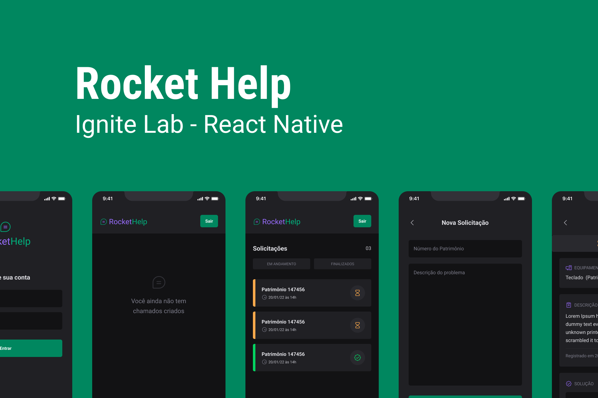
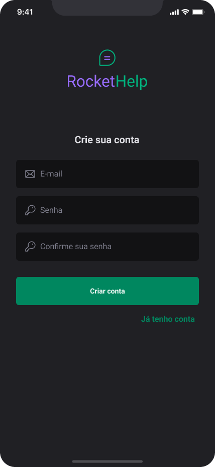
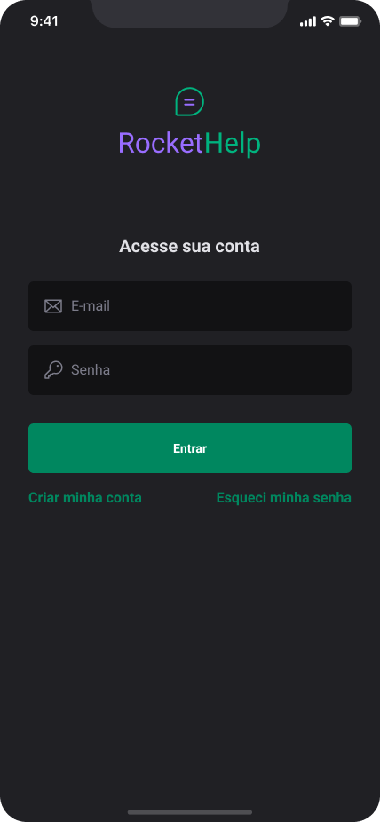
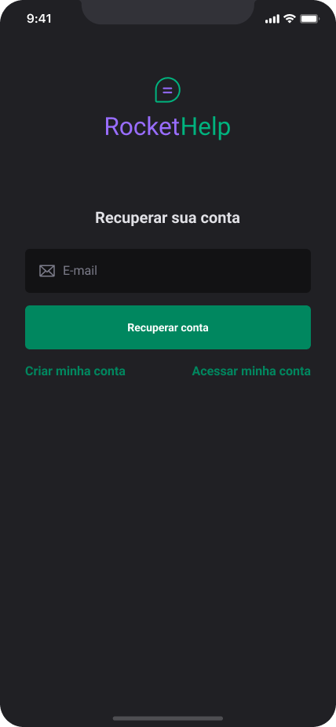
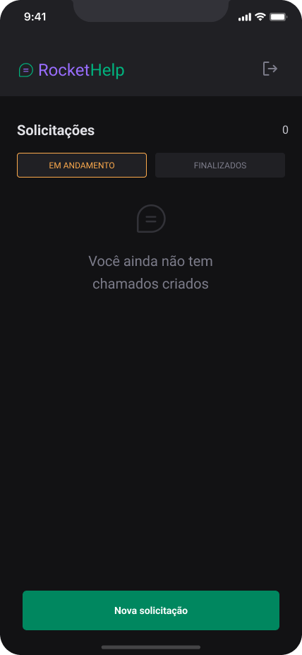
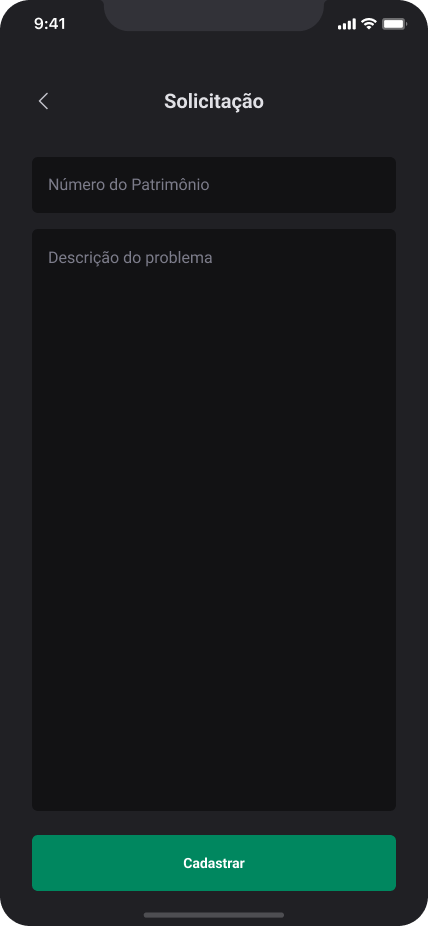
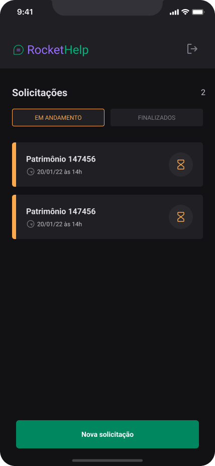
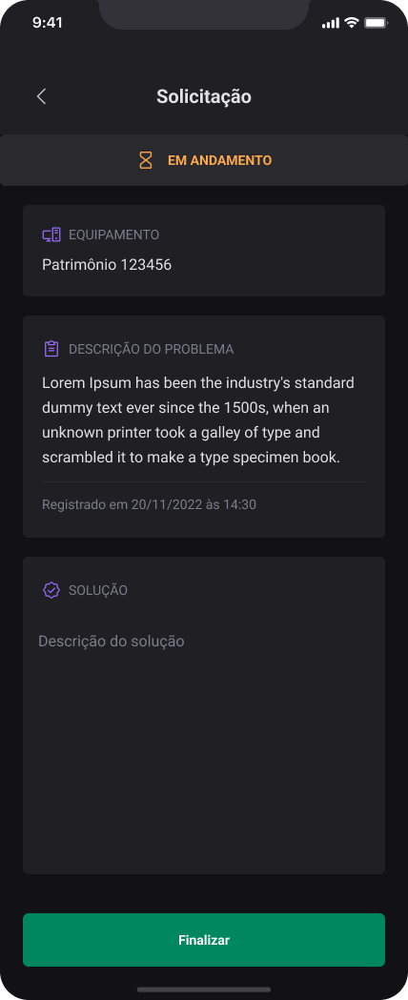
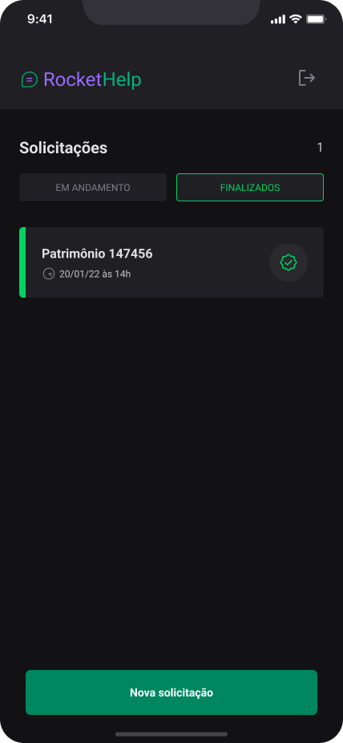

<div align="center" id="top">
  

  &#xa0;

  <!-- <a href="https://rockethelp.netlify.app">Demo</a> -->
</div>

<h1 align="center">Rocket Help - Ignite Lab - React Native</h1>

<p align="center">
  

  

  

  

  

   

  
</p>

<!-- Status -->

<!-- <h4 align="center"> 
	🚧  Rockethelp 🚀 Under construction...  🚧
</h4> 

<hr> -->

<p align="center">
  <a href="#apple-sobre">Sobre</a> &#xa0; | &#xa0;
  <a href="#-telas-das-aplica%C3%A7%C3%A3o">Telas</a> &#xa0; | &#xa0;
  <a href="#-funcionalidades">Funcionalidades</a> &#xa0; | &#xa0;
  <a href="#rocket-tecnologias">Tecnologias</a> &#xa0; | &#xa0;
  <a href="#white_check_mark-o-que-voc%C3%AA-precisa-para-clonar-este-projeto">Requisitos</a> &#xa0; | &#xa0;
  <a href="#checkered_flag-iniciando-o-projeto-em-seu-computador">Inciando o projeto</a> &#xa0; | &#xa0;
  <a href="#memo-licen%C3%A7a">Licença</a> &#xa0; | &#xa0;
  <a href="#-autor">Autor</a>
</p>

<br>

## :apple: Sobre ##

Este projeto foi desenvolvido durante as aulas de Ignite Lab 03 patrocinado pela Rocketseat e ministrado pelo fera Rodrigo.

<br>

# Descrição do projeto

## 🔍 Telas das aplicação ##

                

## 🔥 Funcionalidades ##

- [x] Cadastro de novas contas de usuários
- [x] Recuperação de conta
- [x] Acesso autenticado
- [x] Cadastro de solicitações por usuário
- [x] Listagem de solicitações em aberto
- [x] Listagem de solicitações finalizadas
- [x] Finalizar solicitação
- [ ] Reabrir solicitação finalizada
- [ ] Apagar solicitação em aberto
- [ ] Apagar solicitação finalizada

## :rocket: Tecnologias ##

_Confira abaixo as tecnologias utilizadas no projeto:_

- [Expo](https://expo.io/)
- [Node.js](https://nodejs.org/en/)
- [React Native](https://reactnative.dev/)
- [TypeScript](https://www.typescriptlang.org/)
- [Firebase](https://www.firebase.google.com/)
- [NativeBase](https://nativebase.io/)
- [Phosphor](https://phosphoricons.com/)

## :white_check_mark: O que você precisa para clonar este projeto ##

Antes de clonar o projeto, você precisa ter instalado eu seu sistema:

- [Git](https://git-scm.com)
- [Node](https://nodejs.org/en/)

## :checkered_flag: Iniciando o projeto em seu computador ##

```bash
# Clone this project
$ git clone https://github.com/andrelinos/ignite-lab-rockethelp

# Access
$ cd ignite-lab-rockethelp

# Install dependencies
$ yarn

# Ou npm install

# Run the project
$ yarn android

# ou npm run android
```

## :monkey: Configurando o acesso ao banco de dados ##

### Criando um banco de ados

- Acesse o console do [firebase](https://console.firebase.google.com/)
- Clique em **Adicionar projeto**
- Informe um nome para o projeto
- Clique em continuar
- Na tela seguinte, clique em Continuar novamente

### Criando acesso iOS para o banco de dados

- Com o projeto criado e selecionado, clique em **Visão geral do projeto**
- Agora clique em **+Adicionar app** para registrar um novo app para acesso ao seu banco de dados
- Escolha **iOS+**, preencha ID do pacote Apple e apelido
- Em seguida clique em **Registrar app**
- Na tela seguinte, faça o download do pacote **GoogleService-Info.plist**
- Clique em **Próxima**, em **Próxima** e em **Próxima** novamente e por fim em "Continuar no console**
  
### Criando acesso Android para o banco de dados

- Com o projeto criado e selecionado, clique em **Visão geral do projeto**
-
- Informe o Nome do pacote do Android
- Informe um apelido para o app
- Clique em **Registrar app**
- Na tela seguinte, faça o download do pacote **google-services.json**
- Clique em **Próxima**, em **Próxima** e em **Próxima** novamente e por fim em **Continuar no console**

🦇 **NOTA**: Os dois arquivos devem ser salvos na raiz do projeto.

## ⏰ Configurações do arquivo app.json ##

```json
{
  "expo": {
    "name": "rockethelp",
    "slug": "rockethelp",
    "version": "1.0.0",
    "assetBundlePatterns": [
      "**/*"
    ],
    "plugins": [
      "@react-native-firebase/app"
    ],
    "android": {
      "package": "com.seunome.rockethelp",
      "googleServicesFile": "./google-services.json"
    },
    "ios": {
      "bundleIdentifier": "com.seunome.rockethelp",
      "googleServicesFile": "./GoogleService-Info.plist"
    }
  }
}
```

## 🔺 Apenas para informação ##

```bash
expo prebuild
```

**_Nota_**: Este comando faz a configuração automática do projeto Android e iOS pra você não ter que adicionar as configurações de forma manual os arquivos fora do seu código de desenvolvimento.

## :memo: Licença ##

Este projeto está sob licença MIT. Para mais detalhes, veja o arquivo [LICENSE](LICENSE.md).

## 👽 Autor ##

Feito com :heart: por <a href="https://andrelino.dev" target="_blank">Andrelino Silva</a>

&#xa0;

<a href="#top">Back to top</a>
